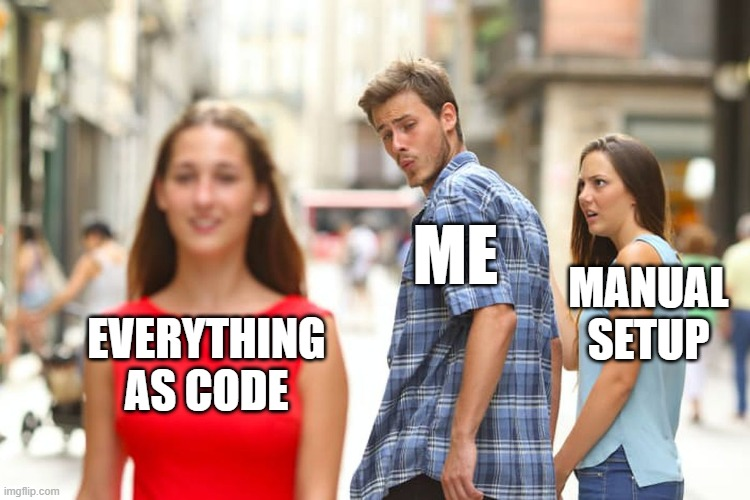
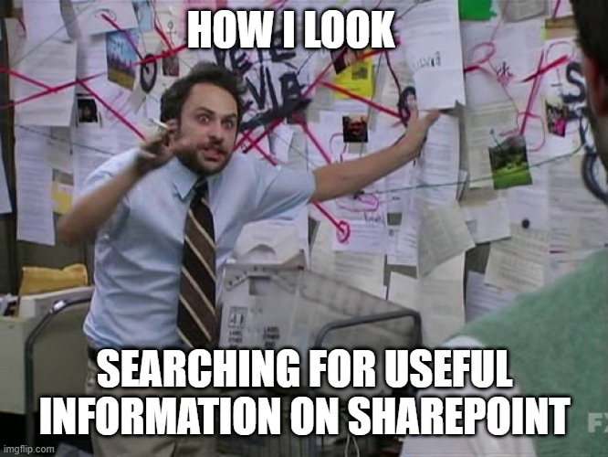

X As Code
##########

:Author: Richelin Metellus
:Date: 2025-03-06
:Version: 1.0

Agenda 
********

* Introduction to X As Code
* Journey to X as Code
* Tools and Technologies
* Case Studies and Examples
* Benefits of Adopting such Framework

..
   https://cummins365-my.sharepoint.com/:p:/g/personal/ua199_cummins_com/EaaUWuAMIbhOvFCnVYikfpUBF7mXSUHZeH6AAokITExovw?e=ESpHha&CID=765F848C-C4F1-475D-81E4-5EF557B946D2&wdLOR=c40B14AF8-9851-42DE-9333-3E2FC9FBC3EF

What Is X As Code 
******************

* also known as **Everything As Code**
* a paradigm that treats various aspects of systems and processes as code. 
* Borrowing on the principles and best practices of application developers
  with the objective of allowing one to capture a *process*, *routine*, or 
  *algorithm* in a textual format

Types
======

.. revealjs-fragments::
   :custom-effect: blur

   1. **Documentation as Code**: Writing documentation in **plain text** files.
      (Topic of this presentation)
   #. **Diagramming as Code**: Create architecture diagrams using **plain text**.
      (Topic of this presentation)
   #. **Infrastructure as Code (IaC)** : Teraform, CI/CD (Jenkins, GitHub Action)

      .. (IaC) Managing and provisioning computing 
         infrastructure through machine-readable definition files, rather than 
         physical hardware configuration or interactive configuration tools.

      

   #. **Configuration as Code**

      .. Storing configuration settings and parameters in version-controlled files, 
         enabling consistent and repeatable configurations across environments.

      .. 
         -------------------------

   #. **Policy as Code (PaC)** and **Security as Code** (HashiCorp Vault)

      .. 
         Policy as Code:
         Defining and enforcing policies using code, allowing for automated 
         compliance checks and policy enforcement.

      .. ---------------

      .. Security as Code
         ----------------------
         Implementing security practices and controls programmatically, ensuring 
         that security measures are consistently applied and auditable.
      

Why Such Paradigm 
*******************

.. revealjs-section::
   :data-transition: concave

Typical C/C++ Application Dev 
==============================

.. revealjs-section::
   :data-auto-animate:

.. uml:: common/_images/src/GnuDevAp2.puml
   :width: 80%
   :alt: This document structure plantuml diagram

.. revealjs-break::
   :data-auto-animate:

* Multiple teams can be responsible for delivering different artifacts
* Complexity can add up very fast
* **Information management might not be optimized if the teams are siloed or 
  worst information got lost as team members leave or retire**

Personal Motivation
====================

.. revealjs-notes::

   Start with story:
   
   |

   My best friend wanted to prepare in advance for classes he will take in the 
   fall semester, asked for my notes. A few days later he said they were 
   useful but he had to decipher my handwriting. As a former pre-med student, I 
   somewhat developed a doctor's style of writing it seems. Thus began my journey 
   to use digital tool to take notes. I tried various 
   available Microsoft products, Word, OneNote, but they were limited. 

.. revealjs-fragments::
   :custom-effect: blur

   * I have doctor-like handwriting 

   * **Solution**

     * The tool should be a self-contained note taking engine which meets 
       a set of features 
     * and should serve as a second brain
   
.. revealjs-break::
   :data-auto-animate:

I wanted a tool with the following features:

.. container:: flex-container

   .. container:: half

      .. code-block:: yaml 

         1. shall not limit one to an 
            ecosystem and should offer 
            flexibility.
         2. should integrate well 
            with version control 
            and offer a way to show the 
            difference between various 
            versions.
         3. shall provide shareability 
            to facilitate collaboration.

   .. container:: half
      
      .. code-block:: yaml 

         4. Contents shall be searchable 
            and re-usable
         5. Tool shall be extensible and 
            customizable by the user
         6. shall support scientific 
            notation, code snippet 
            integration, and have 
            various features for 
            rich content.
            
            * a plus if it has ink support 

Documentation & Diagraming as Code
===================================

Use the same principles of delivering software artifacts 

* Documentation and diagramming can be treated as code
* When written in plaintext, the files can be version controlled.
* Facilitate automation, consistency and collaboration

.. revealjs-break::
   :data-transition: concave
   :notitle:

Use Cases and Example 
***********************

* Technical documentation 
  
  * API documentation, User manuals, user guides 
  * Scientific research & publication

* Various formats: HTML (Static website), LaTeX, pdf, etc...
* Internationalization of docs

Example 1: This presentation 
=============================

.. revealjs-section::
   :data-auto-animate:

   
.. revealjs-break::
   :data-auto-animate:

.. code-block:: console

   Believe it

.. revealjs-break::
   :data-auto-animate:

.. code-block:: console

   Believe it
   OR

.. revealjs-break::
   :data-auto-animate:

.. code-block:: console

   Believe it
   OR
   Not

.. revealjs-break::
   :data-auto-animate:

.. code-block:: console

   Believe it
   OR
   Not
   This presentation is purely written using

.. revealjs-break::
   :data-auto-animate:

.. code-block:: console

   Believe it
   OR
   Not
   This presentation is purely written using
   reStructuredText within a Sphinx project

Example 2: Demo 
===============

Sphinx Project Template

1. Download or Clone `Sphinx Doc Template`_
#. Navigate to the project 
#. Install dependencies & Activate the python virtual environments
   
   .. code-block:: console 
      :linenos:

      pipenv install
      pipenv shell

#. Build the project 

   .. code-block:: console 

      make livehtml

Example 3: Case Study of Toradex Developer Doc 
==================================================

How Toradex leverage DaC using MDX?

Tools and Technologies 
***********************

Doc and Diagraming As Code 

Doc & Diagramming Tool Framework
=================================

.. revealjs-section::
   :data-transition: none

* Typically have 2 main parts 
  
  1. One or more supported **markup languages**
  2. A **builder**

PlantUML 
=========

* `PlantUML <https://plantuml.com/>`_ is a tool that facilitates the creation of 
  a wide array of diagrams (UML diagrams & non-UML diagrams such as 
  Time diagrams, Mindmap, Gantt diagram)

.. revealjs-break::
   :data-transition: concave

.. container:: flex-container

   .. container:: half 

      .. code-block:: plantuml
         :caption: plantuml sequence diagram

         @startuml
         [-> A: DoWork

         activate A

         A -> A: Internal call
         activate A

         A ->] : << createRequest >>

         A<--] : RequestCreated
         deactivate A
         [<- A: Done
         deactivate A
         @enduml

   .. revealjs-fragments::

      .. container:: half 

         |
         |
         |

         .. uml::

            @startuml
            [-> A: DoWork

            activate A

            A -> A: Internal call
            activate A

            A ->] : << createRequest >>

            A<--] : RequestCreated
            deactivate A
            [<- A: Done
            deactivate A
            @enduml

.. revealjs-break::
   :notitle:
   :data-transition: concave

.. container:: flex-container

   .. container:: half 

      .. code-block:: plantuml
         :caption: plantuml activity diagram

         @startuml
         start
         repeat
           :Test something;
             if (Something went wrong?) then (no)
               #palegreen:OK;
               break
             endif
             ->NOK;
             :Alert "Error with long text";
         repeat while (Something went wrong with long text?) is (yes) not (no)
         ->//merged step//;
         :Alert "Success";
         stop
         @enduml

   .. revealjs-fragments::

      .. container:: half 

         .. uml::

            @startuml
            start
            repeat
              :Test something;
                if (Something went wrong?) then (no)
                  #palegreen:OK;
                  break
                endif
                ->NOK;
                :Alert "Error with long text";
            repeat while (Something went wrong with long text?) is (yes) not (no)
            ->//merged step//;
            :Alert "Success";
            stop
            @enduml

.. revealjs-break::
   :notitle:
   :data-transition: concave

.. container:: flex-container

   .. container:: half 

      .. code-block:: plantuml
         :caption: plantuml Gantt Diagram

         @startgantt
         printscale daily
         saturday are closed
         sunday are closed

         Project starts the 1st of january 2021
         [Prototype design end] as [TASK1] requires 8 days
         [TASK1] is colored in Lavender/LightBlue
         [Testing] requires  3 days
         [TASK1]->[Testing]

         2021-01-18 to 2021-01-22 are named [End's committee]
         2021-01-18 to 2021-01-22 are colored in salmon 
         @endgantt

   .. revealjs-fragments::

      .. container:: half2 

         |
         |
         |

         .. uml::
            :width: 100%

            @startgantt
            printscale daily
            saturday are closed
            sunday are closed

            Project starts the 1st of january 2021
            [Prototype design end] as [TASK1] requires 8 days
            [TASK1] is colored in Lavender/LightBlue
            [Testing] requires  3 days
            [TASK1]->[Testing]

            2021-01-18 to 2021-01-22 are named [End's committee]
            2021-01-18 to 2021-01-22 are colored in salmon 
            @endgantt

reStructuredText (rST) by DocUtils
====================================

* Is a plaintext markup language developed by David Goodger as part of the 
  Docutils project.
* The docutils project was originally conceived to convert rST into useful 
  formats such as HTML and LaTeX, etc...

* It works by converting the content of the document to an Abstract Syntax Tree (AST).

.. revealjs-break::
   :data-transition: concave

.. container:: flex-container

   .. container:: half 

      .. literalinclude:: ./rstTest.rst 
         :language: rst

   .. revealjs-fragments::

      .. container:: half 

         .. include:: ./rstTest.rst 

.. revealjs-break::
   :notitle:
   :data-transition: concave

.. container:: flex-container1

   .. container:: half2

      .. code-block:: rst 

         Using rST syntax, one can 
         create a **bold text**

   .. revealjs-fragments::

      Docutils Parser Nodes Representation 

      .. container::

         .. literalinclude:: ./astTest.txt
            
      Extensible through **roles** and **directives**

Markedly Structured Markdown (MyST) 
====================================

* is another markup language for markdown that resemble reStructuredText
* is a superset of CommonMark markdown
* aim at improving the limitation of markdown 
   
  .. inextensible nature of markdown

.. revealjs-break::
   :notitle:
   :data-transition: concave

Markdown equivalent of the rST Syntax shown earlier

   .. literalinclude:: ./rstTest.rst 
      :language: rst

.. literalinclude:: ./mdtest.md 
   :language: markdown

.. revealjs-break::
   :notitle:
   :data-transition: concave

MyST Markdown Specific Syntax.

.. literalinclude:: ./mdTest2.md 
   :language: markdown

Won't work with generic markdown parser.

Sphinx 
********

* `Sphinx`_ is an open-source, python project that is based on 
  Docutils (another open-source python project)
* Enable Automatic API (Code) documentation for Python (default) and other 
  language domains such as C, C++ from docstrings.
* Powerful, extensible authoring tool for technical documentation using 
  `reStructuredText`_ or `MyST Markdown`_.

  .. revealjs-notes:: other markup can be supported as long a parser and builder is 
     added to `Sphinx`_ through the extension mechanism

* Support documentation translation.

.. revealjs-break::
   :data-transition: concave

.. drawio-image:: common/_images/src/SphinxCopy.drawio 
   :page-index: 0
   :alt: Sphinx Phase 

.. revealjs-notes:: Parsers parse source files into an abstract tree
   
   Extensions adds custom functionality. 

   Sphinx ads meta-data, cross-reference and processes sphinx-specific 
   directives/nodes. 

   Builders converts AST into the desired output format

   Themes enrich the visual appearance and structure the of the output

Benefits of X As Code
************************

.. revealjs-fragments::
   
   1. **Consistent & Repeatable Env**

      .. 1. Ensures that environments are consistent and repeatable, 
         reducing the risk of configuration drift.

   2. **Automation through CI/CD**: 

      .. 2. Enables automation of setup, deployment, 
         and management processes, reducing manual effort and errors.

   3. **Version Control**

      .. 3. Allows tracking of changes over time, making it easier to understand 
         the history and evolution of configurations, and content.

   4. **Collaboration**

      .. 4. Facilitates collaboration among team members by using familiar 
         development tools and practices.

   5. **Scalability** 

      .. 5 Makes it easier to scale systems and processes by automating 
         repetitive tasks and ensuring consistency across environments.
         Can deploy the documentation artifacts to suitable host platform
   
   #. **Searchability**

.. revealjs-break::
   :notitle:
   :data-transition: concave

Hopefully, you don't have to look like 
this when looking for information:

Alternatives
**************

Other alternative to Sphinx 

.. container:: flex-container

   .. container:: half
      
      .. revealjs-fragments::

         * MKDocs
         * DocFx 
         * Hugo 

   .. container:: half
      
      .. revealjs-fragments::

         * MDX
         * Notion 
         * Gitbook
         * Confluence 

Q & A 
*******
